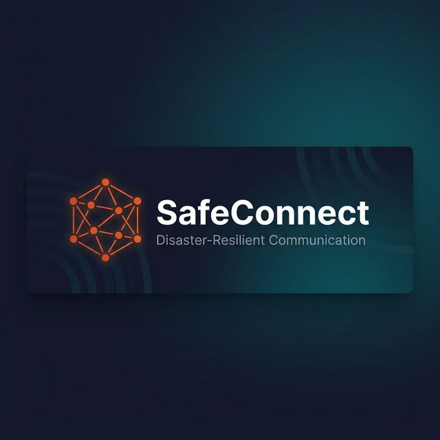
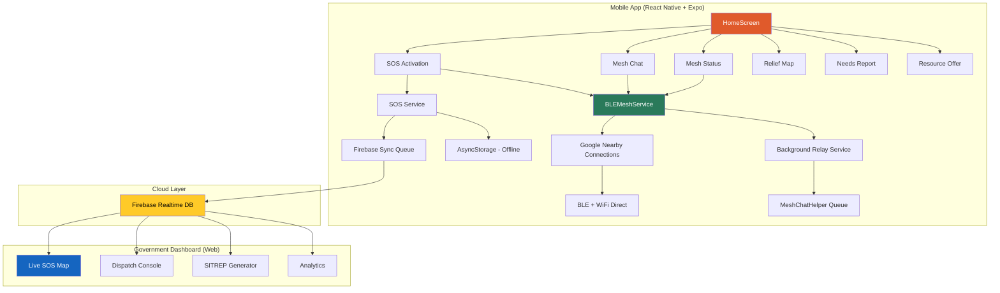

<p align="center">
  
</p>

<h1 align="center">SafeConnect</h1>

<p align="center">
  <strong>Disaster-Resilient Communication · Offline-First · BLE Mesh Networking</strong>
</p>

<p align="center">
  
  
  
  
  
  
</p>

<p align="center">
  <em>A P2P emergency communication platform that works without internet, cell towers, or any infrastructure — using BLE mesh networking to keep communities connected during natural disasters.</em>
</p>

---

## 📋 Table of Contents

- [Problem Statement](#-problem-statement)
- [Solution](#-solution)
- [Key Features](#-key-features)
- [Architecture](#-architecture)
- [Tech Stack](#-tech-stack)
- [Screenshots](#-screenshots)
- [Getting Started](#-getting-started)
- [Project Structure](#-project-structure)
- [How It Works](#-how-it-works)
- [Government Dashboard](#-government-dashboard)
- [Testing](#-testing)
- [Team](#-team)

---

## 🔴 Problem Statement

During natural disasters (floods, earthquakes, cyclones), **traditional communication infrastructure fails first**:

- 📵 Cell towers go offline
- 🌐 Internet connectivity drops
- 📡 Power grids collapse

People are left **isolated**, unable to call for help, inform family, or coordinate rescue. According to NDMA data, **communication failure is the #1 cause of delayed rescue** in Indian disaster scenarios.

---

## 💡 Solution

**SafeConnect** creates a **decentralized, infrastructure-free communication network** using Bluetooth Low Energy (BLE) mesh networking via [Google Nearby Connections](https://developers.google.com/nearby/connections/overview).

```
  Person A (no internet)  ──BLE──►  Person B (no internet)  ──BLE──►  Person C (has internet)
       │                                  │                                  │
       │  SOS sent via mesh              │  Relays the SOS                  │  Uploads to Firebase
       │                                  │                                  │
       ▼                                  ▼                                  ▼
  Message queued locally           Message received & relayed         🏛️ Govt Dashboard sees it
```

**Even if nobody has internet, messages still travel between nearby devices.** The moment *any* device in the mesh gets connectivity, all queued emergency data syncs to the cloud.

---

## ✨ Key Features

### 🆘 Emergency SOS System
- **One-tap SOS activation** with countdown timer and pulsing UI
- Auto-sends **SMS alerts** to trusted contacts with GPS link
- **GPS trail recording** — tracks movement after SOS activation
- **Battery-aware** — shows critical battery warnings on dashboard
- Works **100% offline** — queues for sync when connectivity returns

### 📡 BLE Mesh Networking
- **P2P_CLUSTER strategy** — multi-device many-to-many mesh
- **No internet, no WiFi, no cell signal required**
- Automatic peer discovery, connection, and relay
- Messages hop up to **5 devices** deep with 12-hour TTL
- **Android Foreground Service** keeps mesh alive in background
- Deduplication, hop counting, and TTL expiry for efficiency

### 💬 Offline Mesh Chat
- **Group Chat** — broadcast to all nearby SafeConnect users
- **Private E2EE Chat** — AES-encrypted using phone-number-based room IDs
- Messages persist locally and relay via BLE mesh
- **No Firebase, no server** — purely peer-to-peer delivery

### 🗺️ Relief Map
- Interactive **Leaflet.js map** with relief camp locations
- **Offline map tile caching** for use without internet
- SMS-based emergency navigation to nearest camp

### 📊 Government Dashboard (Web)
- **Real-time SOS monitoring** with sound alerts
- **Dispatch rescue teams** with response tracking
- **SITREP auto-generation** for situation reports
- **Need-Volunteer matching** algorithm
- **Heatmap visualization** of distress intensity
- **Camp capacity monitoring** with overflow alerts
- **Response time leaderboard** by district
- CSV export for reporting

### 🔐 Security & Privacy
- **E2E Encryption** (AES via CryptoJS) for private mesh chats
- **Phone-number-based identity** for private chat room derivation
- No data stored on external servers for chat — strictly local + P2P
- **Offline-first architecture** — everything works without internet

---

## 🏗️ Architecture



### Data Flow Pattern: DTN (Delay-Tolerant Networking)

1. **Store First** — All data saved to `AsyncStorage` immediately (works offline)
2. **Queue for Sync** — Added to sync queue for Firebase upload
3. **Relay via Mesh** — Broadcast over BLE to nearby peers
4. **Gateway Sync** — When *any* device gets internet, queued data uploads
5. **Dashboard Polls** — Govt dashboard fetches from Firebase every 10 seconds

---

## 🛠️ Tech Stack

| Layer | Technology | Purpose |
|-------|-----------|---------|
| **Framework** | React Native 0.81 + Expo 54 | Cross-platform mobile app |
| **Language** | TypeScript 5.9 | Type-safe development |
| **Mesh Networking** | `expo-nearby-connections` (Google Nearby) | BLE + WiFi Direct mesh |
| **Navigation** | React Navigation 7 | Screen routing |
| **Animations** | React Native Reanimated 4 | New Architecture safe animations |
| **State** | AsyncStorage | Offline-first local persistence |
| **Backend** | Firebase Realtime Database | Cloud sync for govt dashboard |
| **Encryption** | CryptoJS (AES) | E2E encrypted private chats |
| **Maps** | React Native Maps + Leaflet.js | In-app and dashboard maps |
| **Notifications** | Expo Notifications + SMS | Push alerts and SMS gateway |
| **Dashboard** | Vanilla HTML/CSS/JS | Government EOC portal |
| **Location** | Expo Location + Task Manager | GPS tracking + background service |

---

## 📱 Screenshots

> Screenshots will be added after the next APK build.

| Home Screen | SOS Active | Mesh Chat | Dashboard |
|:-----------:|:----------:|:---------:|:---------:|
| Emergency Mode toggle, Quick Actions, Live Location | Pulsing SOS ring, GPS trail, Contact alerts | Group + Private E2EE chat via BLE | Real-time SOS map with dispatch |

---

## 🚀 Getting Started

### Prerequisites

- **Node.js** ≥ 18
- **Expo CLI** — `npm install -g expo-cli`
- **EAS CLI** — `npm install -g eas-cli`
- **Android device** (physical) — BLE mesh requires real hardware, not emulator
- **Java JDK 17** (for EAS local builds)

### Installation

```bash
# 1. Clone the repository
git clone https://github.com/NarahariAbhinav/safeconnect.git
cd safeconnect

# 2. Install dependencies
npm install

# 3. Start development server
npx expo start

# 4. Run on Android device
npx expo run:android
```

### Building APK

```bash
# Development APK (with dev tools)
npx eas build --profile development --platform android

# Preview APK (release build, internal distribution)
npx eas build --profile preview --platform android

# Production APK
npx eas build --profile apk --platform android
```

### Running the Government Dashboard

```bash
# Navigate to dashboard directory
cd dashboard

# Serve via HTTP (required for Firebase — file:// won't work)
npx serve .
# OR
python -m http.server 8080

# Open http://localhost:3000 (or :8080) in browser
```

---

## 📁 Project Structure

```
safeconnect/
├── App.tsx                          # Root navigator + error boundary
├── index.ts                         # Entry point
├── app.json                         # Expo configuration
├── eas.json                         # EAS Build profiles
├── package.json                     # Dependencies
│
├── src/
│   ├── screens/
│   │   ├── HomeScreen.tsx           # Main dashboard with quick actions
│   │   ├── LoginScreen.tsx          # Auth + Quick Start (offline guest)
│   │   ├── SignupScreen.tsx         # Account registration
│   │   ├── SOSScreen.tsx            # Emergency SOS activation hub
│   │   ├── MeshChatScreen.tsx       # Group + private offline chat
│   │   ├── MeshStatusScreen.tsx     # BLE mesh network status
│   │   ├── ReliefMapScreen.tsx      # Interactive relief camp map
│   │   ├── NeedsReportScreen.tsx    # "I Need Help" form
│   │   ├── ResourceOfferScreen.tsx  # "I Can Help" form
│   │   ├── ProfileScreen.tsx        # User profile management
│   │   ├── ContactsManagerScreen.tsx # Trusted contacts CRUD
│   │   ├── ContactDetailScreen.tsx  # Individual contact view
│   │   ├── EmergencyAccessScreen.tsx # Emergency quick access
│   │   ├── OnboardingScreen.tsx     # First-time user guide
│   │   └── LocationSharingModal_v2.tsx # Live location sharing
│   │
│   ├── services/
│   │   ├── ble/
│   │   │   ├── BLEMeshService.ts    # Core mesh networking engine
│   │   │   ├── BLEBackgroundRelayService.ts # Background message relay
│   │   │   ├── GattServer.ts        # BLE GATT server (legacy)
│   │   │   └── MeshChatHelper.ts    # Chat queue management
│   │   │
│   │   ├── sos.ts                   # SOS + Needs + Resources + sync
│   │   ├── auth.ts                  # Authentication service
│   │   ├── chatService.ts           # Message persistence
│   │   ├── contacts.ts              # Trusted contacts management
│   │   ├── location.ts              # GPS location service
│   │   ├── locationTrailService.ts  # GPS trail recording
│   │   ├── notificationService.ts   # Push + SMS notifications
│   │   ├── permissionService.ts     # Runtime permission management
│   │   ├── batteryService.ts        # Battery monitoring
│   │   ├── soundService.ts          # Alert sounds
│   │   ├── messages.ts              # Message utilities
│   │   └── OfflineMapHelper.ts      # Offline map tile caching
│   │
│   └── types/                       # TypeScript type definitions
│
├── dashboard/
│   ├── index.html                   # Government EOC dashboard
│   └── dashboard.js                 # Dashboard logic + Firebase polling
│
└── assets/                          # App icons, splash screens
```

---

## ⚙️ How It Works

### BLE Mesh Packet Flow

```
┌──────────────────────────────────────────────────────────┐
│                    MeshPacket Structure                    │
├──────────────────────────────────────────────────────────┤
│  id         │ Unique packet ID (timestamp + random)       │
│  type       │ 'sos' | 'needs' | 'resource' | 'chat'     │
│  payload    │ JSON-stringified data                       │
│  origin     │ userId who created the packet               │
│  hops       │ Incremented at each relay (max 5)           │
│  ttl        │ Unix-ms expiry (12 hours)                   │
│  createdAt  │ Packet creation timestamp                   │
└──────────────────────────────────────────────────────────┘
```

### Connection Lifecycle

1. **Advertise + Discover** — Every device runs both simultaneously
2. **Deterministic Initiator** — Name comparison picks exactly ONE side to connect (prevents deadlock)
3. **Auto-Accept** — Incoming invitations are always accepted (trusted community)
4. **Queue Flush** — On new peer connection, all queued packets are pushed immediately
5. **Relay Chain** — Received packets are re-broadcast with `hops + 1`
6. **Gateway Sync** — Devices with internet upload SOS data to Firebase

### Private Chat E2EE

```
  Sender                              Receiver
    │                                    │
    │  1. Derive roomId from both        │
    │     phone numbers (sorted)         │
    │                                    │
    │  2. AES.encrypt(message, roomId)   │
    │                                    │
    │  3. Broadcast encrypted packet     │
    │     via BLE mesh                   │
    │                                    │
    │              ──────────►           │
    │                                    │
    │     4. Relay devices can't decrypt │
    │        (wrong roomId/key)          │
    │                                    │
    │              ──────────►           │
    │                                    │
    │  5. AES.decrypt(message, roomId)   │
    │     Only receiver has matching     │
    │     phone pair = correct key       │
    └────────────────────────────────────┘
```

---

## 🏛️ Government Dashboard

The web dashboard is designed for **State Disaster Management Authority (SDMA)** Emergency Operations Centers.

| Feature | Description |
|---------|-------------|
| **Live SOS Map** | Real-time markers with GPS trails on Leaflet.js map |
| **Sound Alerts** | Audio beep pattern when new SOS detected |
| **Rescue Dispatch** | Send response status back to user's app (via Firebase + BLE mesh) |
| **SITREP Generator** | Auto-generates situation reports with statistics |
| **Need-Volunteer Matching** | Haversine-distance based matching algorithm |
| **Heatmap Overlay** | Distress intensity visualization |
| **Camp Capacity Alerts** | Banner warnings when camps reach ≥80% occupancy |
| **Response Leaderboard** | District-wise response time ranking |
| **CSV Export** | Download active SOS data for external reporting |
| **Zone/District Filtering** | Filter by geographic zones |

### Dashboard Setup

The dashboard requires HTTP serving (not `file://`) for Firebase CORS to work:

```bash
cd dashboard
npx serve .
```

Then open `http://localhost:3000` in any modern browser.

---

## 🧪 Testing

### Multi-Device Mesh Testing

> ⚠️ BLE mesh requires **physical Android devices** — emulators don't support Nearby Connections.

1. Install the APK on **3+ Android devices**
2. Enable **Bluetooth** and **Location** on all devices
3. Open SafeConnect → Grant permissions → Enable Mesh
4. Test group chat broadcast between all devices
5. Disable internet on 2 devices, keep 1 as gateway
6. Send SOS from offline device → verify it appears on dashboard

### Test Scenarios

| Scenario | Expected Behavior |
|----------|-------------------|
| 3 devices, all offline | Messages relay via BLE mesh between devices |
| SOS with no internet | Queued locally, syncs when internet returns |
| Gateway relay | Device with internet uploads offline peers' SOS to Firebase |
| Private chat | Only sender and receiver can decrypt (AES with phone-based key) |
| App backgrounded | Android foreground service keeps mesh alive |
| Dashboard dispatch | Response shows on user's SOS screen (via Firebase or BLE mesh) |

---

## 🔧 Configuration

### Firebase
The app uses Firebase Realtime Database (free tier, Asia-Singapore region).  
Database URL is configured in:
- `src/services/sos.ts` → `FIREBASE_URL`
- `dashboard/dashboard.js` → `FB`

### Android Permissions
All required permissions are declared in `app.json`:
- `ACCESS_FINE_LOCATION`, `ACCESS_BACKGROUND_LOCATION`
- `BLUETOOTH_SCAN`, `BLUETOOTH_CONNECT`, `BLUETOOTH_ADVERTISE`
- `NEARBY_WIFI_DEVICES`
- `SEND_SMS`

---

## 👥 Team

| Name | Role |
|------|------|
| **Abhinav Narahari** |
| **Sainath Goud** |
| **Chetan Goud** |

**NMIMS University — Semester 8 Project**

---

## 📄 License

This project is developed as an academic project for NMIMS University. All rights reserved.

---

<p align="center">
  <strong>Built with ❤️ for disaster resilience</strong><br/>
  <em>Because communication should never fail when it matters most.</em>
</p>
